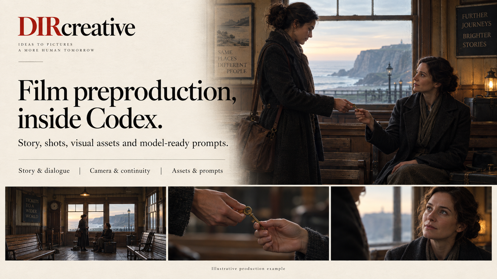

<div align="center">

# DIRcreative

**Film preproduction, inside Codex.**

[English](README.md) · [简体中文](README.zh-CN.md)

[](https://github.com/papperrollinggery/Paperrolling-DIRcreative-SKILL/releases/latest)
[](https://github.com/papperrollinggery/Paperrolling-DIRcreative-SKILL/actions/workflows/ci.yml)

[Website](https://papperrollinggery.github.io/Paperrolling-DIRcreative-SKILL/) · [Get started](#get-started) · [What you can make](#what-you-can-make) · [Dependencies](#skills-that-work-together) · [Documentation](#documentation)

</div>



*AI-generated illustrative artwork; not a screenshot or a verified production result.*

DIRcreative is a **Codex Skill for AI film preproduction**. Develop an idea, screenplay or reference film into a story, shot plan, visual assets and prompts for image and video models. Use it for narrative shorts, commercials, brand films, a single difficult shot, or a focused rewrite.

Start with the work you need. A small edit stays small; a complete preproduction brief connects story, camera, character continuity, assets and sound. Generation uses the capabilities installed in your Codex environment.

## What you can make

| Start with | Get back |
| --- | --- |
| An idea or creative brief | Creative direction, treatment, screenplay and dialogue |
| A script or scene | Shot list, camera positions, blocking, eyelines and action coverage |
| A character, location or product | Visual design, continuity constraints and image-production inputs |
| A local video or supported public link | Timecoded reference analysis and reusable production methods |
| A locked scene and reference assets | Model-specific video prompts, including Seedance 2.5/2.0 bindings |
| Existing prompts or generated assets | Focused edits, observed defects and a practical retry plan |

Outputs depend on the requested scope and available providers. A prompt is ready for submission only after its actual references and model requirements are checked. Image generation, video generation and final approval remain distinct steps.

## Scene-led video prompts

Prompt structure follows the scene: stable references and design, then evolving
action, performance, environment, camera and sound. Authored detail is preserved;
unrequested cinematic prefixes and rhythm formulas are not added. Browse
[six contrasting prompt examples](examples/prompt-structure-quality/README.md)
and the [source-backed research and limits](docs/film-preproduction/research/prompt-structure-20260909.md).

## Product CG styles

Choose from six optional families: dry powder, precision hard surfaces, elastic
fibers, viscous materials, sculptural luxury and graphic modules. The method
connects product facts, material behavior, shot purpose, transitions and timing.
It includes two contrasting video-prompt examples and source-backed research.
See the [product CG library and test boundaries](examples/product-cg-style-library/README.md).

## Get started

You need a Codex environment with Skills support and Python 3.10 or newer. Image, video, transcription and media-download services have their own requirements.

For a **verified release installation**, download the archive and checksums from [GitHub Releases](https://github.com/papperrollinggery/Paperrolling-DIRcreative-SKILL/releases/latest), then follow the [exact-tag installation guide](README.technical.md#verified-release-install). The source version is **v0.12.0**; release assets are authoritative for published availability.

For a development copy:

```bash
git clone https://github.com/papperrollinggery/Paperrolling-DIRcreative-SKILL.git
cd Paperrolling-DIRcreative-SKILL
python3 scripts/install_local_skill.py
```

This installs to `~/.codex/dev-skills/dircreative`. Make that development Skill available in your host, then open a new Codex task and explicitly invoke `$dircreative`:

```text
$dircreative Develop a 30-second short film about two old friends
meeting again because of a lost key. Start with the story and shot plan.
```

Or keep the request focused:

```text
$dircreative Rewrite this scene's dialogue. Preserve the characters'
voices and the events. Deliver only the revised scene.
```

## Skills that work together

DIRcreative includes its internal film-preproduction modules and selects relevant specialist Skills when needed. Installing a dependency does not load every Skill into every request.

- **Jingzao Image Forge** has its own [official repository and releases](https://github.com/papperrollinggery/jingzao-image-forge/releases). The dependency update path checks stable releases and preserves unmanaged, locally edited or newer installations.
- **Redistributable dependencies** are versioned and hash-locked in the dependency bundle, with their license notices retained.
- **Other specialist Skills** remain separately installed. Files without confirmed redistribution permission, third-party services and model access are not included in the bundle.

See the [dependency installation guide](docs/dependencies.md) for the combined install, update commands, included content and remaining setup. The package does not reproduce every capability from the maintainer's computer.

## Frequently asked questions

**Does DIRcreative generate a finished video automatically?**
It organizes preproduction and can hand off to available generation tools within your request. A generated image, a video render and a reviewed final film are different deliverables.

**Is Jingzao required for every image?**
No. DIRcreative uses the existing task and provider selection. Jingzao is an image-production integration, not a replacement for every other provider.

**Can I work in Chinese or English?**
Yes. Give the brief and requested output language in your prompt. Both project overviews and introduction graphics are available in Chinese and English.

**Does a passing check prove creative quality?**
No. Automated checks cover contracts, files and workflow behavior. Visual quality requires inspection of the actual output.

## Documentation

- [Technical guide and verified installation](README.technical.md)
- [Dependency installation and update](docs/dependencies.md)
- [Film-development workflow](skills/dircreative/references/film-development.md)
- [Storyboard coverage](skills/dircreative/references/storyboard-coverage.md)
- [Reference-video analysis](skills/dircreative/references/video-distillation.md)
- [Seedance handoff](skills/dircreative/references/script-to-seedance.md)
- [Examples](examples/) · [Changelog](CHANGELOG.md) · [Machine-readable project index](llms.txt)
- Landing-page source: [English](site/index.html) · [简体中文](site/zh/index.html)

For source validation, run `PYTHONDONTWRITEBYTECODE=1 python3 scripts/validate_project.py`. Additional development dependencies and historical audit scopes are documented in the technical guide.

## License

A general license for DIRcreative has not yet been granted. Public availability does not itself grant redistribution rights. Bundled third-party material retains its own explicitly stated license; those licenses do not apply to DIRcreative as a whole.
