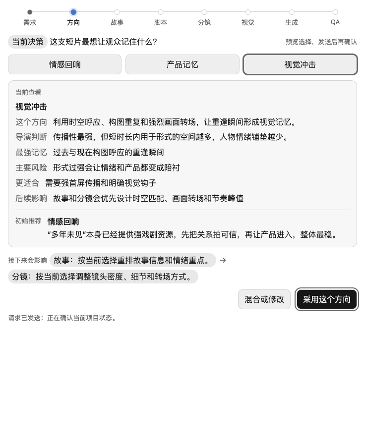

<div align="center">

# DIRcreative

**A chat-first film preproduction skill for Codex.**

把一句创意发展成可讨论、可选择、可验证的导演方案、故事、脚本、镜头、参考图计划与模型专用提示词。

[](https://github.com/papperrollinggery/Paperrolling-DIRcreative-SKILL/releases/latest)
[](https://github.com/papperrollinggery/Paperrolling-DIRcreative-SKILL/actions/workflows/ci.yml)


[快速开始](#quick-start) · [能力](#what-it-does) · [交互体验](#visual-conversational-workflow) · [示例](#examples) · [文档](#documentation) · [正式安装](#verified-release-install)

</div>



DIRcreative 不是“输入一句话、吐出一堆提示词”的黑盒。它先判断任务是局部修改、完整开发还是交付审计，再只加载对应合同。局部任务直接交付修改结果；只有真实方向冲突、生成授权或客户交付才停下来询问。

当前已发布稳定版本仍为 [`v0.4.0`](https://github.com/papperrollinggery/Paperrolling-DIRcreative-SKILL/releases/tag/v0.4.0)。当前源码 checkout 另含 v2 路由、动态专业视角、紧凑状态、拆分模型 Adapter 和 Specialist Exchange v2；本地验证通过不等于这些改动已经发布。

## Why DIRcreative

- **先创作，后生成**：先解决受众、叙事、产品证明和镜头逻辑，再进入图片或视频生成。
- **把专业判断放在结果后面**：Fast 直接修改；Studio 最多选择三个真正影响结果的专业视角，不展示固定角色会议。
- **让复杂方案看得懂**：方向比较、节奏曲线、镜头时间线、参考图依赖和 QA 结果都可以可视化。
- **不锁定单一模型**：把同一镜头意图适配到 Seedance、Kling、Runway、Veo 等不同生成模型。
- **证据可追溯**：阶段门、用户选择、来源、版本、安装包与校验结果都有结构化记录。

## What it does

| 模式 | 适用任务 | 默认预算与产出 |
| --- | --- | --- |
| Fast | 一句/一段文案、单镜头、少量分镜、Prompt 或既有产物局部修改 | 0 Threads、0 Director Room；修改结果优先 |
| Studio | 完整概念、故事+脚本、脚本+分镜、多产物影视前期 | 0 Threads 默认、最多 3 个动态专业视角、最多 1 个 critic |
| Delivery | 真实生成授权、正式版本/资产、客户可见交付、有效 ADCO handoff | 可运行完整审计与 receipt；严格绑定真实输入输出 |

```text
explicit $dircreative → router → Fast | Studio | Delivery
                     → one Route Card → useful artifact first
```

## Visual, conversational workflow

可视化不是装饰，而是每个用户决策的操作界面：

- **方案比较卡**：选中项、推荐理由和下游影响同步变化，避免“选择变了、建议没变”。
- **曲线与时间线**：展示情绪、信息密度、钩子、产品曝光和镜头节奏。
- **关系图**：说明角色、场景、产品、参考图和最终镜头之间的继承关系。
- **图片审阅**：在对话中查看候选图、放大关键区域、标记问题，并决定采用、重试或改方向。
- **明确空状态**：没有媒体时显示生成前置条件与下一步，不使用假图冒充结果。
- **响应式布局**：桌面端并排比较，窄屏自动改为可读的纵向流程。

2026-07-14 对 `v0.4.0` 交互面的本地浏览器验收覆盖 **14 个页面、84 个响应式场景、0 个失败**；复现命令见 [Development and validation](#development-and-validation)。技术门禁证明界面和工作流按约定运行，但不会替代具体客户项目的真人创意验收。

## Quick start

### Prerequisites

- 支持 Skills 的 Codex 环境
- Python 3.10+
- Ruby（项目总验证中的 YAML 兼容检查需要）
- 可选：Node.js 20+ 与 Playwright，仅用于 84 场景浏览器审计
- 可选：GitHub CLI `gh`，仅用于下载正式 Release

### 1. Clone and install a development copy

```bash
git clone https://github.com/papperrollinggery/Paperrolling-DIRcreative-SKILL.git
cd Paperrolling-DIRcreative-SKILL
python3 scripts/install_local_skill.py
```

开发副本安装到 `~/.codex/dev-skills/dircreative`，不会覆盖正式 SkillHub 安装。

### 2. Run the demo and validation

```bash
PYTHONDONTWRITEBYTECODE=1 python3 scripts/dircreative_headless_acceptance_audit.py
PYTHONDONTWRITEBYTECODE=1 python3 scripts/validate_project.py
```

安装后请打开一个新的 Codex 任务，并显式写 `$dircreative`。隐式调用已关闭；普通广告问题或仓库维护不会启动本 Skill。

### 3. Start in Codex

可以直接用自然语言开始：

```text
$dircreative 把“多年未见的朋友，因为一件旧物重新联系”
发展成一支 30 秒品牌短片。先给我推荐方向和首轮故事，不生成图片或视频。
```

DIRcreative 会选择 Fast、Studio 或 Delivery。Fast 不进入 Director Room；Studio 只选择能改变结果的 `narrative_strategy`、`visual_production`、`model_continuity` 视角，最多三个。用户不需要点名固定角色。

## Safety model

- 未获得用户明确授权，不直接生成图片或视频。
- 先展示生成合同：每张参考图的用途、继承来源、标题层级和是否会成为视频输入。
- fixture、终端演示、HTML 页面和自动化测试不能冒充真人验收。
- 生成候选、临时截图和 review widget 不能自动成为项目 source of truth。
- 不在未授权情况下修改目标项目的 `AGENTS.md`。

## ADCO Integration

DIRcreative 既可以独立在聊天中运行，也可以作为 ADCO 的影视前期专业 worker：

```yaml
protocol_id: adco.specialist-exchange
contract_version: "2.0"
execution_mode: inline
```

ADCO 负责客户交互、Current Truth、采用决策、版本、可见性、PPT、FinalDelivery、完成状态和 cleanup；DIRcreative v2 只返回领域产物、领域 QA、状态和开放问题，不复制这些控制平面字段。v1 handoff/receipt/adoption 仍可读取。

```bash
python3 scripts/dircreative_adco_native_exchange.py --self-test
python3 scripts/dircreative_adco_native_exchange.py \
  --adco-repo /path/to/ad-creative-orchestrator
```

未提供 `--adco-repo` 时，发布门只报告 `RELEASE_GATE_SCOPE: DIR_ONLY`，不能作为双边兼容证据。完整协议见 [`adco-integration-contract.md`](docs/film-preproduction/adco-integration-contract.md)。

## Examples

| 示例 | 适合查看 |
| --- | --- |
| [`live-user-sim-noodle`](examples/live-user-sim-noodle/) | 从一句产品创意到方向、脚本、镜头、参考图与模型提示词的完整对话 |
| [`cyber-courier`](examples/cyber-courier/) | Director Room 如何形成并选择概念方向 |
| [`goal-mode-simulation-test`](examples/goal-mode-simulation-test/) | 用户不逐项回复时，如何标注模拟选择并安全继续 |
| [`assisted-generation-preflight-chat`](examples/assisted-generation-preflight-chat/) | 用户说“看看图”时，如何先完成生成前置门 |
| [`zombie-cleaner-test`](examples/zombie-cleaner-test/) | 180 秒长叙事的拆解、参考计划与 prompt-only 测试 |

## Documentation

- [`System plan`](docs/film-preproduction/01-system-plan.md) — 系统架构、角色、适配器和 QA 门
- [`Runtime contracts`](docs/film-preproduction/runtime-contracts.md) — v2 单一合同所有者、上下文边界和兼容矩阵
- [`Chat co-creation interface`](docs/film-preproduction/chat-co-creation-interface.md) — 结果优先的聊天呈现指南
- [`Director Room perspectives`](docs/film-preproduction/director-room-council-protocol.md) — 动态专业视角、真实分歧与 v1 只读边界
- [`Live chat start protocol`](docs/film-preproduction/live-chat-start-protocol.md) — 粗想法、完整想法、测试和图片请求的入口
- [`Film commercial quality standard`](docs/film-preproduction/film-commercial-quality-standard.md) — 影视与商业质量门
- [`Model sources`](docs/film-preproduction/sources/model-sources.yaml) — 有日期和证据等级的模型能力卡
- [`Release and integration architecture`](docs/film-preproduction/05-skill-integration-architecture.md) — Skill、运行时和发布结构

完整规范、schemas、研究与运行手册位于 [`docs/film-preproduction`](docs/film-preproduction/)。

## Verified release install

正式安装源是同一 GitHub Release 中经过校验的归档和 `SHA256SUMS`，不是可变的分支 checkout。

```bash
gh release download v0.4.0 \
  --repo papperrollinggery/Paperrolling-DIRcreative-SKILL \
  --pattern 'dircreative-0.4.0.tar.gz' \
  --pattern 'SHA256SUMS'
```

<details>
<summary><strong>验证远程 tag、精确 commit、SHA-256 和可复现归档</strong></summary>

```bash
set -euo pipefail
REPO_URL="https://github.com/papperrollinggery/Paperrolling-DIRcreative-SKILL.git"
TAG="v0.4.0"
EXPECTED_COMMIT="$(
  git ls-remote --exit-code --tags "$REPO_URL" \
    "refs/tags/$TAG" "refs/tags/$TAG^{}" |
  awk -v ref="refs/tags/$TAG^{}" '
    $2 == ref { count += 1; sha = $1 }
    END {
      if (count != 1 || length(sha) != 40 || sha !~ /^[0-9a-f]+$/) exit 1
      print sha
    }
  '
)"
ARTIFACT="$(pwd)/dircreative-0.4.0.tar.gz"
CHECKSUMS="$(pwd)/SHA256SUMS"
VERIFY_ROOT="$(mktemp -d)"
trap 'rm -rf "$VERIFY_ROOT"' EXIT
git clone --filter=blob:none --no-checkout "$REPO_URL" "$VERIFY_ROOT/source"
git -C "$VERIFY_ROOT/source" fetch --depth 1 origin \
  "refs/tags/$TAG:refs/tags/$TAG"
git -C "$VERIFY_ROOT/source" checkout --detach "$EXPECTED_COMMIT"
python3 "$VERIFY_ROOT/source/scripts/dircreative_verify_release.py" \
  --artifact "$ARTIFACT" \
  --checksums "$CHECKSUMS" \
  --expected-version 0.4.0 \
  --expected-commit "$EXPECTED_COMMIT" \
  --expected-tag "$TAG" \
  --reproducible-source "$VERIFY_ROOT/source" \
  --require-reproducible-match \
  --require-remote-tag \
  --extract-to /tmp/dircreative-v0.4.0
```

</details>

安装到规范 SkillHub 路径：

```bash
python3 /tmp/dircreative-v0.4.0/dircreative-0.4.0/scripts/install_local_skill.py \
  --target ~/.skillshub/dircreative \
  --formal-install
```

安装后验证：

```bash
cd ~/.skillshub/dircreative
python3 scripts/validate_project.py
python3 scripts/dircreative_adco_native_exchange.py --self-test
```

## Development and validation

最常用的本地门禁：

```bash
python3 scripts/validate_project.py
python3 scripts/dircreative_activation_policy_audit.py
python3 scripts/dircreative_context_budget_audit.py
python3 scripts/dircreative_director_harness_audit.py
python3 scripts/dircreative_prompt_fixture_audit.py
python3 scripts/dircreative_headless_acceptance_audit.py
python3 scripts/dircreative_readiness_audit.py
python3 scripts/dircreative_quality_audit.py
python3 scripts/dircreative_chat_surface_audit.py
python3 scripts/dircreative_visualization_dogfood.py
python3 scripts/dircreative_adco_native_exchange.py --self-test
```

完整发布门：

```bash
python3 scripts/dircreative_release_gate.py \
  --require-tag \
  --adco-repo /path/to/ad-creative-orchestrator
```

`--allow-unpublished` 仅用于开发或 CI 预发布检查，不是正式 release 证据。发布门会绑定干净的精确 commit，验证源码、行为、临时安装、独立校验归档和可选的 ADCO 双边兼容。

复现完整浏览器响应式审计：

```bash
npm ci
npx playwright install chromium
python3 scripts/dircreative_visualization_dogfood.py
npm run audit:visual-browser
```

审计覆盖 736px / 320px、明暗主题、文字间距和大字号模式，并检查横向溢出、文字重叠、裁切、触控目标、图片状态、选择后的推荐同步和可执行动作。

## Contributing

欢迎通过 [Issues](https://github.com/papperrollinggery/Paperrolling-DIRcreative-SKILL/issues) 报告问题或提出改进。提交前请：

1. 保持修改范围集中，不把 fixture 结果写成真人验收。
2. 为 bug 补最小复现或回归测试。
3. 运行 `python3 scripts/validate_project.py` 和与改动相关的审计脚本。
4. 不提交客户素材、密钥、真实运行历史或个人绝对路径。

Issue 与 PRD 约定见 [`docs/agents/issue-tracker.md`](docs/agents/issue-tracker.md)。

### Fixture media notice

`outputs/reference-pack/` 中的图片是用于测试参考图绑定与审阅流程的 AI-generated fixtures。仓库公开或标记为 `project_owned` 仅描述 fixture 在测试中的归属关系，不授予素材商用权，也不替代对具体模型条款、品牌权利和投放地区的独立审核。

## License

This repository is publicly readable, but no open-source license has been granted yet. Until a license is added, default copyright restrictions apply.

本仓库目前可公开阅读，但尚未授予开源许可证。在正式添加许可证之前，默认著作权限制仍然适用。
